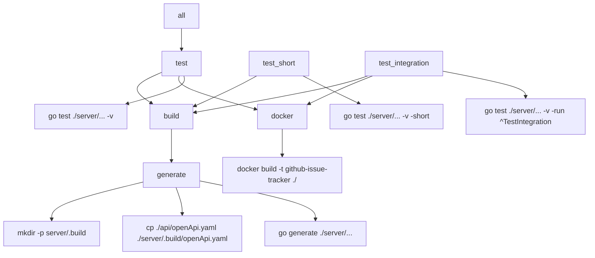

# Project Build Flow



- **all**: Runs `test`
- **test**: Depends on `build` and `docker`, then runs all tests
- **build**: Depends on `generate`, then builds the server
- **generate**: Prepares build directory, copies OpenAPI spec, runs code generation
- **test_short**: Runs short tests after build
- **test_integration**: Runs integration tests after build and docker
- **docker**: Builds Docker image

```

```
