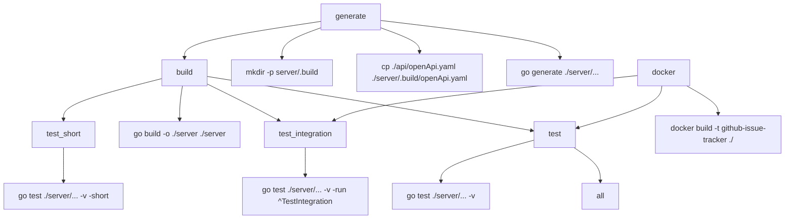

# Project Build Flow

- **all**: No recipe
- **build**: Runs `go build -o ./server ./server`
- **generate**: Runs `mkdir -p server/.build; cp ./api/openApi.yaml ./server/.build/openApi.yaml; go generate ./server/...`
- **test**: Runs `go test ./server/... -v`
- **test_short**: Runs `go test ./server/... -v -short`
- **test_integration**: Runs `go test ./server/... -v -run ^TestIntegration`
- **docker**: Runs `docker build -t github-issue-tracker ./`
